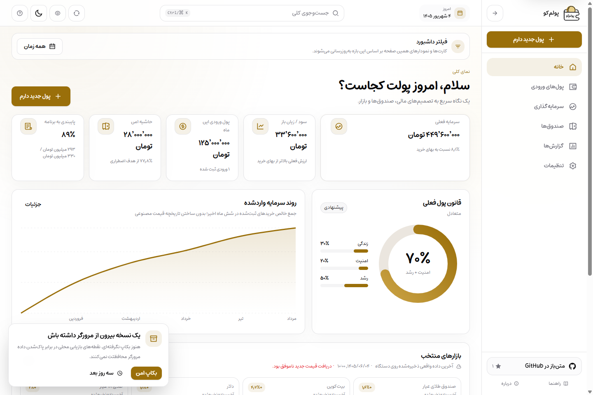
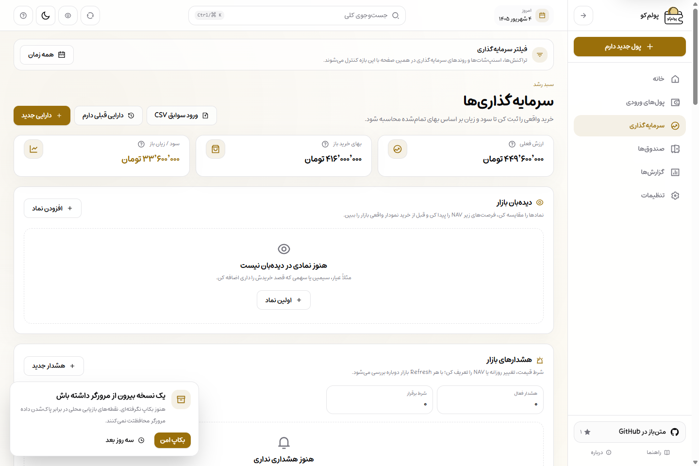
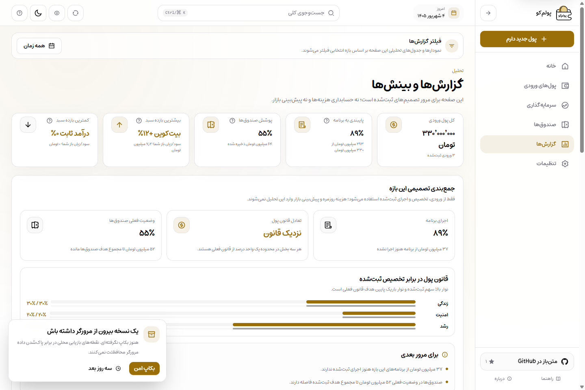
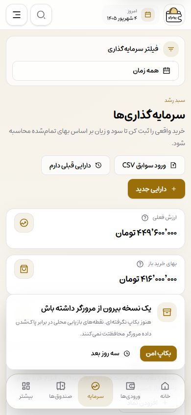

# Poolamkoo — پولم‌کو
> v0.40 note: Settings now includes a fully local data-health audit for cross-ledger integrity. It detects orphan links, negative historical ledgers, stale fund/plan summary fields, archived open holdings and duplicate market identities; deterministic summary drift can be repaired only after a Recovery Snapshot. IndexedDB stays schema 8.
> v0.39 note: Incoming-money corrections now preserve executed history. Amount edits cannot go below already executed money, only unexecuted plan amounts are rescaled, execution locks the income date, future dates are rejected, and every valid correction creates a local Recovery Snapshot. IndexedDB stays schema 8.
> v0.38 note: Goal-fund balances now have an auditable local movement ledger. Manual deposits/withdrawals support date, note, edit/delete with chronological non-negative validation; plan/direct allocation and income-reversal flows use the same ledger. Existing balances migrate in place to one opening movement. IndexedDB is schema 8.
> v0.36 note: Investment transactions can now be corrected in place with a recovery snapshot and chronological ledger validation. Backdated sells, edits, and deletes are rejected when they would make historical holdings negative; same-day buys are treated as available for same-day sells because Poolamkoo stores transaction dates, not intraday times. IndexedDB stays schema 7.
> v0.35 note: The production browser release gate now seeds a real legacy schema-6 IndexedDB profile and verifies the in-place 6→7 migration, provider normalization, compound indexes, and same-market-id TSETMC/Tindex coexistence before running the normal workspace/PWA smoke. Schema remains 7.
> v0.34 note: Persisted exchange identity now uses provider + market-id too. IndexedDB schema 7 migrates legacy Tindex-linked assets/watchlist/alerts safely, watchlist uniqueness is provider-scoped, and old backups are normalized before restore without changing backup formats.
> v0.33 note: Provider-linked assets now keep source + market-id identity through portfolio, watchlist, alerts, planning and reports. Snapshot prices remain visible for continuity but cannot drive alert state, new-money priorities, automatic growth allocation, transaction price suggestions or best/worst ranking; detailed CSV exports now include valuation provenance.
> v0.32 note: Partial market refreshes now keep fresh provider rows while filling only relevant missing quotes from the latest real local snapshots; snapshot provenance is visible across the app, coverage is explicit in Settings diagnostics, and snapshot-only quotes never trigger local market alerts.
> v0.31 note: Settings now exposes live provider status for BrsApi/TSETMC/Tindex plus a privacy-safe copyable market diagnostic containing only operational health metadata—never prices, symbols, asset names, market IDs, amounts, raw upstream text, or provider secrets.
> v0.30 note: Market requests now use provider health/failure classification, bounded TSETMC request budgets, parallel independent refreshes, safe user-facing errors, and explicit degraded-state metadata while preserving real local snapshots/manual prices and optional legacy Tindex fallback.
> v0.29 note: Reports now has local CSV export plus a share-safe summary with no amounts/asset names; the mobile More/search surfaces are calmer, the drawer truly dismisses by dragging its handle down, and workspace card motion now follows one top-to-bottom direction.
> v0.28.2 animation/tooling hotfix: Tailwind CSS v4 now imports `tailwindcss-animated` through its explicit `src/index.css` entry for Turbopack/Windows compatibility, shared modal bodies use transform-only CSS motion so they are never blank, and the market route lint regression is fixed.
> v0.28.1 motion hotfix: `motion` is restored for code-split viewport/scroll reveals on the public Landing, while Workspace entrances remain per-item `tailwindcss-animated` staggers with no whole-route animation.
> v0.28 note: new Tehran exchange links now use direct server-side TSETMC search/quotes/history without an API key; Tindex is optional legacy/emergency fallback with quota-protecting cache windows.
> v0.27.4 runtime/motion hotfix: workspace entrance motion now uses `tailwindcss-animated` per item with ~55ms stagger instead of a Motion runtime/whole-route transition, while GitHub stats no longer has any Promise fetch/AbortSignal cleanup path.
> v0.27.3 motion/runtime hotfix: GitHub stats no longer aborts a fetch during React cleanup, and workspace navigation now uses visible-at-every-frame route motion plus top-to-bottom item staggering with reduced-motion fallbacks.
> v0.27.2 hotfix: Dashboard content and shared dialog bodies never start at `opacity: 0`; motion is now visibility-safe, and the production browser gate verifies normal-motion Dashboard and modal content.
> v0.27.1 hotfix: workspace client-side navigation no longer wraps entire routes in exit/opacity animation, and the production browser gate now verifies Reports → Settings → Reports without a reload or blank content.
> v0.27 note: the public Landing hero is redesigned around the approved Light/Dark product artwork, critical hero content no longer depends on Motion hydration, and the public header now has a local theme toggle with reduced-motion-safe transition.
> v0.26.1 hotfix: full-source replacement now removes the obsolete root `app/manifest.ts` route so the public Landing cannot accidentally advertise the installable PWA; the production browser gate guards this exact regression.
> v0.26 release note: a real production-browser smoke gate now verifies Landing → Workspace, fresh onboarding/local bootstrap, Reports decision insights and PWA boundaries from an isolated fake-data profile, without adding Playwright/Cypress.
> v0.25 note: Reports now surface factual plan/allocation/fund follow-ups from recorded local data, and the public Landing hero uses approved local Light/Dark product visuals. Windows product-media capture also avoids the previous `spawn EINVAL` path.
> v0.24.1 note: the v0.24 portfolio/PWA work is release-hardened, the canonical Latin project name is **Poolamkoo**, and privacy-safe product screenshot capture is available locally and in GitHub Actions.
> v0.24 decision UX note: Investments now compares each real holding's current share with the user-defined target and keeps PWA installation/runtime inside workspace routes; normal `/` remains the public landing page.

### A Persian-first, RTL, local-first PWA for incoming-money planning, goal funds, and personal investment tracking

[فارسی](./README.fa.md) · [Documentation](./docs/README.md) · [Security](./SECURITY.md) · [License](./LICENSE)

---

## What is Poolamkoo?

Poolamkoo is not a daily bookkeeping app. It is designed for the moment new money arrives: decide how much should go to life, safety, and growth, then record what was actually executed and measure the outcome later.

The core product loop is:

```text
Incoming money
      ↓
Allocation plan
      ↓
Actual execution
      ↓
Portfolio and funds
      ↓
Reports and feedback
```

Core personal-finance data is stored locally in the user's browser through IndexedDB. Normal use does not require an account or a central user database.

## Website and app entry

Since v0.19, `/` is the public product landing page while the local-first financial application starts at `/dashboard`. The installed PWA also starts at `/dashboard`. This route split does not move or recreate IndexedDB because browser storage is scoped to the origin, not the URL path.

## Product scope

### Incoming money and planning

- Record new money with Persian-friendly amount and date inputs
- Configurable life / safety / growth rule
- Emergency-fund-aware smart allocation
- Per-income overrides without changing the global rule
- Correct incoming money safely without shrinking below already executed plan money
- Create, edit, and delete plan cards
- Record full or partial execution
- Compare planned versus actual behavior

### Investments

- Gold, currency, crypto, stocks/exchange, investment funds, and custom assets
- Record real buy and sell transactions
- Bulk historical investment import from CSV with preview and validation
- Search and link Tehran Stock Exchange stocks/ETFs directly to TSETMC quotes without an API key
- Manual fallback prices for linked exchange assets and manual pricing for custom assets
- Link purchases back to an incoming-money plan
- Average purchase price and cost basis
- Current value and unrealized P/L
- Target allocation versus actual portfolio weight
- Rebalance guidance using new money rather than synthetic trades

### Goal funds

- Emergency fund
- Planned costs such as medical care, travel, insurance, and gifts
- Target, balance, due date, and progress tracking
- Auditable deposit/withdrawal history with date, note, safe correction, and system-source provenance without turning the app into detailed expense bookkeeping

### Market data

- BrsApi-first pricing for gold, currency, and crypto with short shared server caching; Tindex is only an optional core fallback
- Direct server-side TSETMC search, quotes, and history for new Tehran Stock Exchange stocks and ETFs
- Explicit TSETMC/Tindex/BrsApi source attribution wherever external quotes are displayed
- One shared market store across the application
- One initial fetch plus explicit manual refresh
- Settings provider-health view with a privacy-safe copyable diagnostic that excludes prices, symbols, asset names, market IDs, amounts, raw upstream text, and secrets
- Partial-refresh continuity: fresh quotes always win, while only missing core/requested exchange quotes can reuse their latest real local Snapshot
- Snapshot provenance is visible on Dashboard, portfolio, watchlist and market details; local alerts wait for a fresh quote instead of evaluating a Snapshot fallback
- Real snapshots stored locally
- Real 1-month and 3-month TSETMC history for linked exchange assets; optional Tindex history for USD/18K gold
- Line history for public indicators and real exchange candlesticks, with local snapshots as fallback
- No fake historical market series
- Market watchlist for tracking TSE stocks/ETFs before adding them to the portfolio
- NAV and market-price premium/discount only when the active provider actually supplies NAV; the direct TSETMC price adapter does not invent missing NAV
- Local price, daily-move, and NAV alerts with duplicate-notification suppression
- Local market alerts; the Background Push experiment remains paused in the backlog by default

### Reports

- Total incoming money and plan adherence
- Decision summary for plan execution, money-rule balance, and current goal-fund coverage
- Explicit incomplete-allocation state instead of filling missing period data from configured targets
- Factual follow-up prompts based only on recorded local data
- Returns from the user's recorded purchases
- Target versus actual portfolio allocation
- Charts only when real local data exists
- Privacy mode for hiding financial values on screen

### Data durability and backups

- Visible backup health with stale/never-backed-up states
- Friendly reminders after meaningful use and again after seven days
- AES-GCM encrypted backup download with shared toast/error handling
- v2 backup envelope with SHA-256 corruption detection plus app/schema metadata
- Restore inspection with compatibility checks and record preview before replacement; legacy v1 files remain readable
- Up to five local recovery snapshots for accidental destructive changes
- Daily recovery checkpoints plus pre-destructive snapshots for key financial deletes/restores
- Browser persistence status without pretending browser storage is a permanent backup
- Device-local backup metadata and recovery history excluded from exported financial payloads
- Direct encrypted WebRTC device transfer with copy/share pairing codes and preview before import
- Recovery snapshot before destination replacement, with encrypted backup files kept as the universal fallback
- Recovery and direct-transfer schema guards stop newer-format data before destructive import

### Public landing and production resilience

- Public Persian landing page at `/` and financial app entry at `/dashboard`
- `robots.txt`, `sitemap.xml`, and app-route `noindex` boundaries
- Explicit IndexedDB bootstrap error/timeout state instead of an indefinite skeleton
- Offline status banner plus improved offline fallback
- Global error, route error, and 404 recovery surfaces without destructive reset shortcuts
- Keyboard skip links on public and app shells
- Explicit PWA update prompt that activates a waiting Service Worker only after user confirmation
- Multi-tab IndexedDB upgrade protection for blocked/outdated tabs before financial live queries start

### User experience

- Persian-first RTL interface
- PWA with offline shell
- Responsive, mobile-first layout with safe-area-aware fixed navigation
- Four daily mobile destinations kept one tap away: Home, Incoming Money, Investments, and Funds
- Collapsible desktop sidebar with active-route semantics
- Keyboard-navigable global search across sections, incoming money, funds, and assets
- Light, dark, and system themes
- Gold-first visual palette
- Product tour and contextual financial help
- Layout-matched skeletons with restrained shimmer
- Reduced-motion-aware route, KPI, navigation, and toast micro-interactions

### Optional privacy-first analytics

- Cloudflare Web Analytics only in production and only when the deployer supplies a site token
- No analytics SDK dependency and no custom financial events
- Visits, page views, route paths, device/browser categories, and Core Web Vitals for coarse product usage
- No intentional analytics payloads containing amounts, balances, personal asset names, transactions, search text, form values, backups, or device-transfer data
- No token means no third-party analytics beacon is rendered

## Open source and support

Poolamkoo is public at https://github.com/hamedtkd/poolamkoo. The app now includes public guide, About, Privacy/Data policy, and data-safety pages plus a cached GitHub star count. Optional development support is available at https://daramet.com/hamedtkd and never unlocks product features.

## Local-first and privacy

Poolamkoo stores core product data in IndexedDB for the current browser profile and origin. There is no central Poolamkoo database containing users' personal financial records by default.

This model means:

- No account is required for core workflows.
- Financial records stay under the user's direct browser storage.
- Clearing site data can remove local records.
- Private browsing is not appropriate for durable storage.
- Regular exported backups are important for serious use.
- Settings can audit cross-ledger consistency entirely on-device and only repairs deterministic summary drift after creating a Recovery Snapshot.

See [SECURITY.md](./SECURITY.md) for the security and data-safety model.

## Stack

- Next.js 16 with App Router
- React 19 and TypeScript
- Tailwind CSS 4
- shadcn/ui plus PersianLabs UI components for Persian UX
- Dexie and IndexedDB
- React Hook Form and Zod
- TanStack Table
- Recharts and Lightweight Charts where appropriate
- next-themes
- `tailwindcss-animated` for lightweight CSS micro-interactions and per-item staggered Workspace entrances
- `motion` for code-split viewport/scroll reveals where interaction timing matters
- Optional Cloudflare Web Analytics through the official hosted beacon, with no analytics SDK
- Remix Icons through react-icons

## Repository structure

```text
app/            routes, layouts, and API routes
components/     UI primitives, app shell, charts, and feature components
hooks/          reusable feature logic and state
lib/            models, calculations, validation, database, and market adapters
public/         PWA assets, service worker, and icons
docs/           architecture, development phases, and release documentation
scripts/        quality gates and UI architecture checks
tests/          unit tests for financial logic
```

## Quick start

### Requirements

- Node.js 22.x
- npm
- Git

### Install and run

```bash
npm install
cp .env.example .env.local
npm run dev
```

The public landing page normally runs at `http://localhost:3000`, while the local-first application starts at `http://localhost:3000/dashboard`.


## Landing product visual

The public hero uses two approved local WebP assets so the presentation follows Light/Dark appearance without reading user financial data. The numbers inside these promotional images are sample values.

<table>
  <tr>
    <td width="50%"></td>
    <td width="50%"></td>
  </tr>
</table>

## Product screenshots

Poolamkoo can regenerate product screenshots from the real production build with an isolated fake-data browser profile. The capture does not read your normal browser profile or real financial records.

```bash
npm run media:capture
```

If a fresh production build already exists:

```bash
npm run media:capture:built
```

The output is written to `docs/assets/screenshots/`. A manual **Product media** GitHub Actions workflow runs the same capture and uploads `poolamkoo-product-screenshots` as an artifact. See [docs/assets/README.md](./docs/assets/README.md) for the privacy contract, browser-path override, and exact screenshot list.

The README paths are ready for those generated files; after a verified capture is committed, GitHub renders the real product UI here:

<p align="center">
  
</p>

<table>
  <tr>
    <td width="50%"></td>
    <td width="50%"></td>
  </tr>
  <tr>
    <td width="50%"></td>
    <td width="50%"></td>
  </tr>
  <tr>
    <td width="50%"></td>
    <td width="50%"></td>
  </tr>
  <tr>
    <td colspan="2" align="center"></td>
  </tr>
</table>

## Market data

For core gold/currency/crypto quotes, configure `BRS_API_KEY`. **New Tehran exchange links need no API key:** Poolamkoo searches and reads `cdn.tsetmc.com` through its own server routes. `TINDEX_API_TOKEN` remains optional in v0.34 and is retained only for legacy links, a slow emergency core fallback, and optional USD/gold online history. Provider failures are classified into stable health codes; upstream response bodies are never surfaced to users.

TSETMC exchange prices are returned in rial and normalized to toman on the server. TSETMC current quotes use a short shared cache and daily history uses an hourly cache; BrsApi also uses a short server cache so multiple browsers do not multiply provider requests. If an external provider is unavailable, Poolamkoo never fabricates prices/history: real IndexedDB snapshots and then the user's manual fallback price remain available. Existing `source: tindex` records are preserved and can be re-linked to TSETMC at the user's convenience.

## Privacy-first analytics

Poolamkoo v0.18 can optionally load Cloudflare Web Analytics in production. Add the site in Cloudflare Web Analytics, copy the token from its browser snippet, and set only the production deployment environment:

```env
NEXT_PUBLIC_CLOUDFLARE_WEB_ANALYTICS_TOKEN=your_site_token
```

This is a public Web Analytics site token, not a Cloudflare account API secret. If the variable is empty, the analytics component renders nothing. Development builds also keep the beacon disabled even if a token is present.

The integration is intentionally coarse: Cloudflare can measure visits, page views, page paths, device/browser categories, and real-user performance. Poolamkoo does not emit custom analytics events from financial data, search text, forms, backups, or device transfers. See [docs/analytics.md](./docs/analytics.md) for setup and privacy boundaries.

## Market alerts and background push

Local market alerts work without a backend and are evaluated when the app refreshes live quotes. The v0.13.0 Background Web Push experiment is **intentionally paused and hidden by default in v0.13.1** so the public project remains zero-cost and local-first, with no required Redis, scheduler, VAPID keys, or cron secret.

The experiment has not been deleted. Its implementation and future opt-in instructions remain in [docs/backlog/background-push.md](./docs/backlog/background-push.md). The next zero-cost product phases are tracked in [docs/ROADMAP.md](./docs/ROADMAP.md).

## Quality gate

Run the normal local gate before committing:

```bash
npm run check
npm run build
```

For a release candidate, run the production-browser gate too:

```bash
npm run check:release
```

`check:release` runs the normal quality suite, creates one production build, then opens that build in an isolated Chrome/Edge/Chromium profile and verifies the legacy schema 6 → current schema 8 database migration before Landing → Workspace, fresh onboarding/local bootstrap, Reports and PWA boundaries. No Playwright/Cypress dependency is required. If browser auto-detection fails, set `POOLAMKOO_BROWSER_PATH`.

## PWA

Poolamkoo includes a web app manifest, service worker, offline route, install icons, and a favicon. Release QA should include real installation tests on desktop and mobile in addition to browser DevTools checks.

See [docs/testing/release.md](./docs/testing/release.md) for the release checklist.

## Documentation

Start at [docs/README.md](./docs/README.md). Architecture notes, development phases, and release-specific changes live under `docs/` so this README can remain a stable product overview.

## Security

Please avoid publishing sensitive security details or real personal financial data in public issues. See [SECURITY.md](./SECURITY.md) for reporting guidance.

## License

See [LICENSE](./LICENSE).

### Direct device transfer

Settings can now move local data directly to another device without an account or financial-data backend. Pairing uses copy/share codes, the payload is additionally protected with a one-time AES-GCM PIN, the receiver previews record counts before import, and a recovery snapshot is created before destination replacement. See [docs/device-transfer.md](./docs/device-transfer.md).

### v0.37 — Safe asset archive lifecycle

Asset archive is now reversible and guarded: open holdings or unfinished asset-targeted plans cannot be archived, archived assets can be restored with a Recovery Snapshot, and legacy archived holdings remain included in portfolio valuation until restored. IndexedDB remains schema 7.
### v0.38 — Auditable fund movement ledger

Goal-fund balances now have a first-class local movement history. Manual deposits and withdrawals can be dated, noted, corrected, or deleted only when chronological replay stays non-negative; plan execution, direct new-money funding, and income-deletion reversals use the same ledger boundary. Existing positive balances migrate in place to one opening movement as IndexedDB advances to schema 8.
